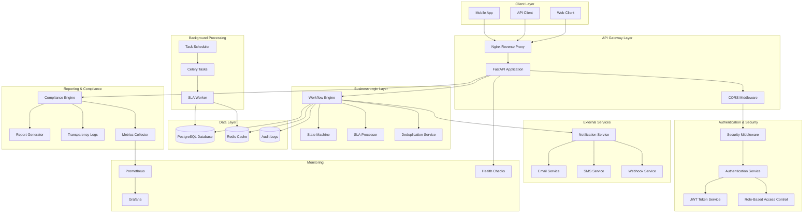
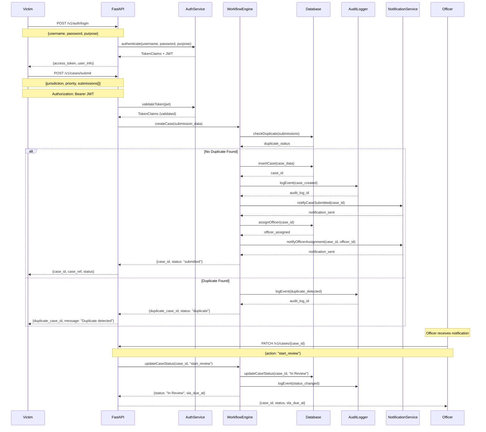
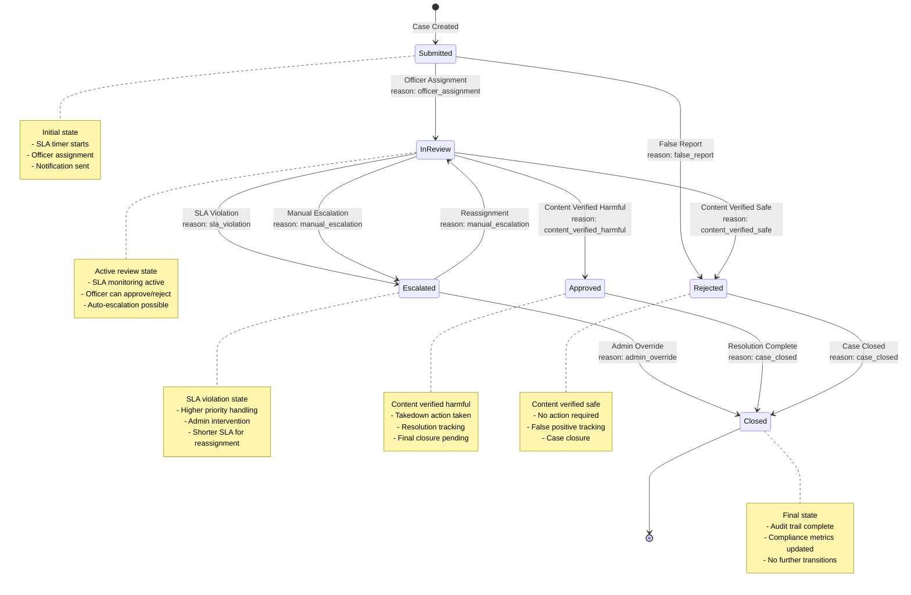
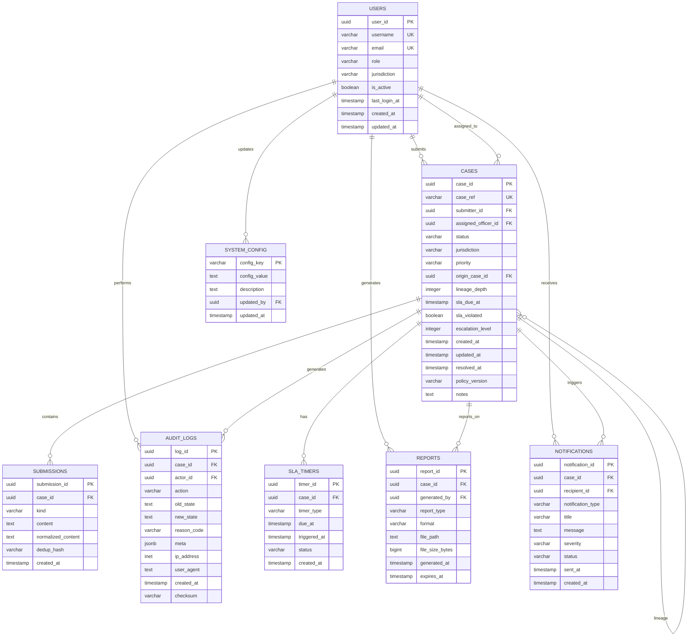
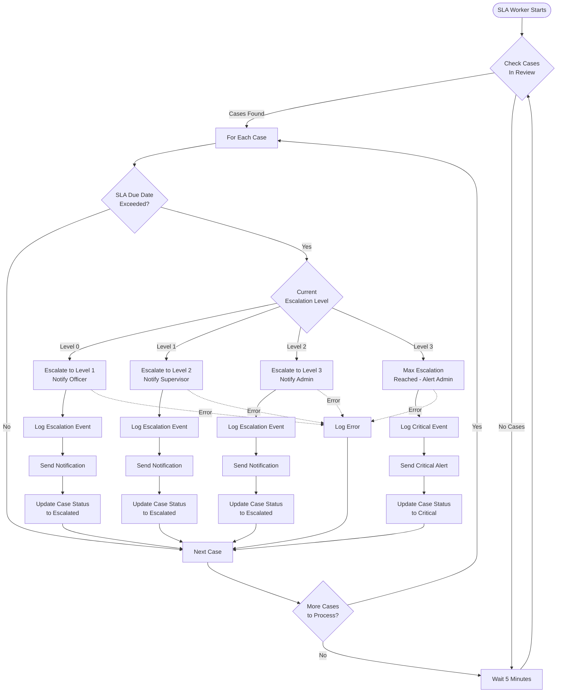

# Take It Down Backend - UML Diagrams

This document contains comprehensive UML diagrams for the Take It Down Backend - Victim-Led Content Removal System.

## 1. System Architecture Component Diagram



## 2. Class Diagram - Core Domain Models

```mermaid
classDiagram
    class User {
        +UUID user_id
        +String username
        +String email
        +UserRole role
        +String jurisdiction
        +Boolean is_active
        +DateTime last_login_at
        +DateTime created_at
        +DateTime updated_at
        +authenticate(password: String) Boolean
        +hasPermission(action: String) Boolean
    }
    
    class Case {
        +UUID case_id
        +String case_ref
        +UUID submitter_id
        +UUID assigned_officer_id
        +CaseStatus status
        +String jurisdiction
        +CasePriority priority
        +UUID origin_case_id
        +Integer lineage_depth
        +DateTime sla_due_at
        +Boolean sla_violated
        +Integer escalation_level
        +DateTime created_at
        +DateTime updated_at
        +DateTime resolved_at
        +String policy_version
        +String notes
        +submit() Boolean
        +assignOfficer(officerId: UUID) Boolean
        +updateStatus(status: CaseStatus) Boolean
        +escalate() Boolean
    }
    
    class Submission {
        +UUID submission_id
        +UUID case_id
        +SubmissionKind kind
        +String content
        +String normalized_content
        +String dedup_hash
        +DateTime created_at
        +validate() Boolean
        +normalize() String
        +generateHash() String
    }
    
    class AuditLog {
        +UUID log_id
        +UUID case_id
        +UUID actor_id
        +String action
        +String old_state
        +String new_state
        +String reason_code
        +JSONB meta
        +String ip_address
        +String user_agent
        +DateTime created_at
        +String checksum
        +calculateChecksum() String
        +verifyIntegrity() Boolean
    }
    
    class WorkflowEngine {
        -Map transitions
        -Map sla_config
        +canTransition(context: CaseContext, action: String, userRole: String) Tuple
        +executeTransition(context: CaseContext, action: String, userId: String, userRole: String) Tuple
        +getAvailableActions(context: CaseContext, userRole: String) List
        +getSlaStatus(context: CaseContext) String
        +shouldEscalate(context: CaseContext) Boolean
    }
    
    class CaseContext {
        +String case_id
        +CaseStatus current_status
        +CasePriority priority
        +String jurisdiction
        +String submitter_id
        +String assigned_officer_id
        +Integer escalation_level
        +DateTime sla_due_at
        +DateTime created_at
        +DateTime updated_at
    }
    
    class StateTransition {
        +CaseStatus from_status
        +CaseStatus to_status
        +ReasonCode reason_code
        +String required_role
        +Integer sla_hours
        +Boolean auto_escalation
        +String description
    }
    
    class AuthenticationService {
        -SecurityConfig config
        -PasswordValidator validator
        -TokenService token_service
        +authenticate(username: String, password: String, purpose: String) TokenClaims
        +validateToken(token: String) TokenClaims
        +refreshToken(token: String) String
        +revokeToken(token: String) Boolean
    }
    
    class NotificationService {
        -Map templates
        -List channels
        +sendNotification(caseId: String, type: String, recipientId: String, severity: String) Boolean
        +notifyCaseEscalation(caseId: String, level: Integer, officerId: String) Boolean
        +notifySlaWarning(caseId: String, hoursRemaining: Integer, officerId: String) Boolean
    }
    
    class ComplianceEngine {
        -TransparencyLogger logger
        -ReportGenerator generator
        +generateMetrics(fromDate: DateTime, toDate: DateTime) ComplianceMetrics
        +generateReport(type: ReportType, format: ReportFormat) Report
        +logTransparencyEvent(event: TransparencyEvent) Boolean
        +verifyAuditIntegrity(caseId: String) Boolean
    }
    
    %% Relationships
    User ||--o{ Case : submits
    User ||--o{ Case : assigned_to
    User ||--o{ AuditLog : performs
    Case ||--o{ Submission : contains
    Case ||--o{ AuditLog : generates
    Case ||--o{ Case : lineage
    WorkflowEngine --> CaseContext : manages
    WorkflowEngine --> StateTransition : defines
    AuthenticationService --> User : authenticates
    NotificationService --> Case : notifies
    ComplianceEngine --> Case : reports
```

## 3. Sequence Diagram - Case Submission Workflow



## 4. State Machine Diagram - Case Lifecycle



## 5. Database Entity Relationship Diagram



## 6. Use Case Diagram

```mermaid
graph TB
    subgraph "Take It Down Backend System"
        subgraph "Victim Use Cases"
            UC1[Submit Takedown Request]
            UC2[View Own Cases]
            UC3[Track Case Status]
        end
        
        subgraph "Officer Use Cases"
            UC4[Review Cases]
            UC5[Approve/Reject Cases]
            UC6[Assign Cases]
            UC7[Escalate Cases]
            UC8[Generate Reports]
        end
        
        subgraph "Admin Use Cases"
            UC9[Manage Users]
            UC10[System Configuration]
            UC11[View All Cases]
            UC12[Override Decisions]
            UC13[System Monitoring]
        end
        
        subgraph "System Use Cases"
            UC14[Duplicate Detection]
            UC15[SLA Monitoring]
            UC16[Auto Escalation]
            UC17[Audit Logging]
            UC18[Notification Sending]
            UC19[Compliance Reporting]
        end
    end
    
    subgraph "Actors"
        VICTIM[Victim]
        OFFICER[Content Officer]
        ADMIN[System Admin]
        SYSTEM[System]
    end
    
    %% Victim interactions
    VICTIM --> UC1
    VICTIM --> UC2
    VICTIM --> UC3
    
    %% Officer interactions
    OFFICER --> UC4
    OFFICER --> UC5
    OFFICER --> UC6
    OFFICER --> UC7
    OFFICER --> UC8
    
    %% Admin interactions
    ADMIN --> UC9
    ADMIN --> UC10
    ADMIN --> UC11
    ADMIN --> UC12
    ADMIN --> UC13
    
    %% System interactions
    SYSTEM --> UC14
    SYSTEM --> UC15
    SYSTEM --> UC16
    SYSTEM --> UC17
    SYSTEM --> UC18
    SYSTEM --> UC19
    
    %% Cross-actor interactions
    UC1 -.-> UC14 : triggers
    UC4 -.-> UC15 : monitored by
    UC5 -.-> UC17 : logged by
    UC7 -.-> UC18 : triggers
```

## 7. Activity Diagram - SLA Violation Handling



## 8. Deployment Diagram

```mermaid
graph TB
    subgraph "Production Environment"
        subgraph "Load Balancer Tier"
            LB[Nginx Load Balancer<br/>SSL Termination]
        end
        
        subgraph "Application Tier"
            APP1[FastAPI App Instance 1<br/>Port 8000]
            APP2[FastAPI App Instance 2<br/>Port 8000]
            APP3[FastAPI App Instance 3<br/>Port 8000]
        end
        
        subgraph "Background Processing"
            WORKER1[SLA Worker 1]
            WORKER2[SLA Worker 2]
            CELERY[Celery Task Queue]
        end
        
        subgraph "Database Tier"
            DB_MASTER[(PostgreSQL Master<br/>Port 5432)]
            DB_REPLICA1[(PostgreSQL Replica 1<br/>Read Only)]
            DB_REPLICA2[(PostgreSQL Replica 2<br/>Read Only)]
        end
        
        subgraph "Cache Tier"
            REDIS_MASTER[(Redis Master<br/>Port 6379)]
            REDIS_REPLICA[(Redis Replica<br/>Port 6379)]
        end
        
        subgraph "Monitoring Tier"
            PROMETHEUS[Prometheus<br/>Port 9090]
            GRAFANA[Grafana<br/>Port 3000]
            ALERTMANAGER[AlertManager<br/>Port 9093]
        end
        
        subgraph "Storage Tier"
            FILES[File Storage<br/>Reports & Logs]
            BACKUP[Backup Storage<br/>Daily Snapshots]
        end
    end
    
    subgraph "External Services"
        SMTP[SMTP Server<br/>Email Notifications]
        SMS_API[SMS Gateway<br/>Text Notifications]
        WEBHOOK_API[Webhook Endpoints<br/>External Integrations]
    end
    
    %% Load balancer connections
    LB --> APP1
    LB --> APP2
    LB --> APP3
    
    %% Application connections
    APP1 --> DB_MASTER
    APP2 --> DB_MASTER
    APP3 --> DB_MASTER
    
    APP1 --> DB_REPLICA1
    APP2 --> DB_REPLICA2
    APP3 --> DB_REPLICA1
    
    APP1 --> REDIS_MASTER
    APP2 --> REDIS_MASTER
    APP3 --> REDIS_MASTER
    
    %% Background processing connections
    WORKER1 --> DB_MASTER
    WORKER2 --> DB_MASTER
    WORKER1 --> REDIS_MASTER
    WORKER2 --> REDIS_MASTER
    CELERY --> WORKER1
    CELERY --> WORKER2
    
    %% Database replication
    DB_MASTER -.->|Replication| DB_REPLICA1
    DB_MASTER -.->|Replication| DB_REPLICA2
    REDIS_MASTER -.->|Replication| REDIS_REPLICA
    
    %% Monitoring connections
    APP1 --> PROMETHEUS
    APP2 --> PROMETHEUS
    APP3 --> PROMETHEUS
    PROMETHEUS --> GRAFANA
    PROMETHEUS --> ALERTMANAGER
    
    %% Storage connections
    APP1 --> FILES
    APP2 --> FILES
    APP3 --> FILES
    DB_MASTER --> BACKUP
    
    %% External service connections
    APP1 --> SMTP
    APP2 --> SMS_API
    APP3 --> WEBHOOK_API
```



## Summary

These UML diagrams provide a comprehensive view of the Take It Down Backend system:

1. **Component Diagram**: Shows the overall system architecture and how components interact
2. **Class Diagram**: Details the core domain models and their relationships
3. **Sequence Diagram**: Illustrates the case submission workflow
4. **State Machine**: Shows the complete case lifecycle with all possible transitions
5. **ER Diagram**: Database schema with all tables and relationships
6. **Use Case Diagram**: User interactions and system capabilities
7. **Activity Diagram**: SLA violation handling process
8. **Deployment Diagram**: Production environment setup

The system follows a microservices architecture with clear separation of concerns, comprehensive audit logging, and robust SLA management for victim-led content removal requests.
