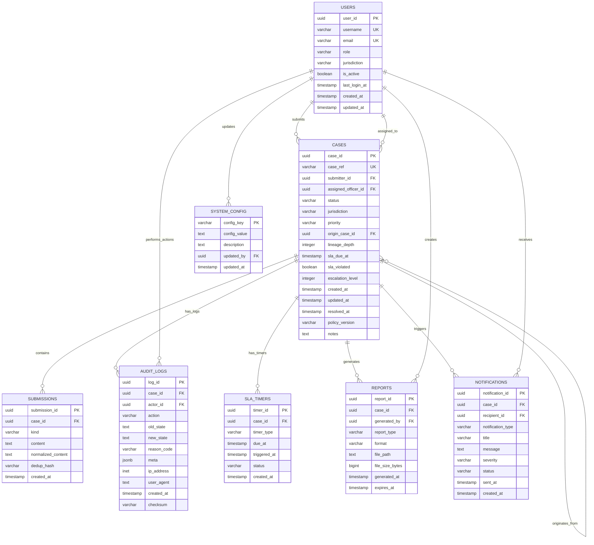

# Database Entity Relationship Diagram

## Take It Down Backend - Database Schema



## Key Features

### 🔗 Lineage Tracking
- **origin_case_id**: Links duplicate cases to their original
- **lineage_depth**: Tracks how many generations deep a case is
- Enables forensic analysis of case relationships

### 🔍 Deduplication
- **dedup_hash**: SHA256 hash of normalized content
- **normalized_content**: Cleaned URL/hash for comparison
- Prevents duplicate submissions across cases

### 📊 Audit Trail
- **reason_code**: Structured reason for each action
- **checksum**: Cryptographic integrity verification
- **meta**: Rich JSON metadata for context

### ⏰ SLA Management
- **sla_timers**: Background job tracking
- **escalation_level**: Multi-level escalation support
- **sla_violated**: Compliance flagging

### 🔔 Notifications
- **severity**: Priority levels (low, medium, high, critical)
- **status**: Delivery tracking
- **notification_type**: Categorized alerts

## Indexes for Performance

```sql
-- Critical indexes for fast lookups
CREATE INDEX idx_cases_status ON cases(status);
CREATE INDEX idx_cases_sla_due ON cases(sla_due_at) WHERE status = 'In Review';
CREATE INDEX idx_submissions_dedup ON submissions(dedup_hash);
CREATE INDEX idx_audit_case ON audit_logs(case_id);
CREATE INDEX idx_sla_timers_due ON sla_timers(due_at) WHERE status = 'pending';
```

## Views for Common Queries

- **case_summary**: Aggregated case information with SLA status
- **sla_metrics**: Compliance statistics by jurisdiction and date
