# Take It Down Backend - Workflow Engine

## State Machine Diagram

```mermaid
stateDiagram-v2
    [*] --> Submitted : Victim submits case
    
    Submitted --> In Review : Officer starts review
    Submitted --> Submitted : Duplicate detected
    
    In Review --> Approved : Officer approves
    In Review --> Rejected : Officer rejects
    In Review --> Escalated : SLA violation (auto)
    In Review --> Escalated : Manual escalation
    
    Escalated --> In Review : Admin reassigns
    Escalated --> Escalated : Further escalation
    
    Approved --> Closed : Officer closes
    Rejected --> Closed : Officer closes
    
    Closed --> [*]
    
    note right of Submitted
        Initial state
        SLA: 48 hours
        Priority-based timing
    end note
    
    note right of In Review
        Officer assigned
        SLA monitoring active
        Can approve/reject
    end note
    
    note right of Escalated
        SLA violated
        Escalation level tracked
        Requires admin attention
    end note
```



## Reason Codes System

### Submission Reasons
- `initial_submission` - First-time case submission
- `duplicate_detected` - Duplicate content found

### Review Reasons
- `officer_assignment` - Case assigned to officer
- `review_started` - Review process initiated
- `review_completed` - Review process finished

### Decision Reasons
- `content_verified_harmful` - Content confirmed as harmful
- `content_verified_safe` - Content confirmed as safe
- `insufficient_evidence` - Not enough evidence
- `false_report` - Report determined to be false
- `jurisdiction_issue` - Outside jurisdiction

### SLA Reasons
- `sla_violation` - Automatic escalation due to SLA
- `sla_extended` - SLA deadline extended
- `manual_escalation` - Manual escalation by admin

### System Reasons
- `system_escalation` - Automated system escalation
- `case_closed` - Case resolution completed
- `case_reopened` - Case reopened for review

## SLA Configuration

| Priority | SLA Hours | Escalation Levels |
|----------|-----------|-------------------|
| Low      | 72        | 3                 |
| Medium   | 48        | 3                 |
| High     | 24        | 3                 |
| Urgent   | 12        | 3                 |

## Workflow Rules

### State Transitions
1. **Submitted → In Review**: Officer assignment required
2. **In Review → Approved/Rejected**: Officer decision with reason
3. **In Review → Escalated**: SLA violation or manual escalation
4. **Escalated → In Review**: Admin reassignment
5. **Any → Closed**: Final resolution

### Role Permissions
- **Victim**: Submit cases only
- **Officer**: Review, approve, reject, close cases
- **Admin**: All actions + escalation management
- **System**: Auto-escalation based on SLA

### SLA Processing
1. **Background Worker**: Runs every 5 minutes
2. **Warning Threshold**: 2 hours before SLA deadline
3. **Escalation**: Automatic when SLA exceeded
4. **Notifications**: Sent to officers and admins

## Example Workflow

### Case Lifecycle
```
1. Victim submits case (Submitted)
   ├─ Reason: initial_submission
   ├─ SLA: 48 hours (medium priority)
   └─ Auto-assignment to available officer

2. Officer starts review (In Review)
   ├─ Reason: officer_assignment
   ├─ SLA: 48 hours remaining
   └─ Notification sent to officer

3a. Officer approves (Approved)
    ├─ Reason: content_verified_harmful
    ├─ Action taken on content
    └─ Notification sent to victim

3b. SLA violation (Escalated)
    ├─ Reason: sla_violation
    ├─ Escalation level: 1
    └─ Notifications sent to officer + admins

4. Admin reassigns (In Review)
   ├─ Reason: manual_escalation
   ├─ SLA: 24 hours (reduced)
   └─ New officer assigned

5. Officer approves (Approved)
   ├─ Reason: content_verified_harmful
   └─ Case resolution completed

6. Officer closes (Closed)
   ├─ Reason: case_closed
   └─ Final audit log created
```

### Duplicate Detection
```
1. Victim submits URL/hash
2. System normalizes content
3. Generates dedup_hash
4. Checks existing submissions
5a. No match → Create new case
5b. Match found → Link to origin case
   ├─ Reason: duplicate_detected
   ├─ Origin case ID stored
   └─ Lineage depth incremented
```

## Monitoring & Metrics

### SLA Metrics
- **Compliance Rate**: % of cases resolved within SLA
- **Average Resolution Time**: Mean time to resolution
- **Escalation Rate**: % of cases requiring escalation
- **Violation Rate**: % of cases exceeding SLA

### Performance Metrics
- **Cases per Hour**: Processing throughput
- **Officer Workload**: Cases assigned per officer
- **Response Time**: Time to first officer action
- **Resolution Quality**: Approval vs rejection rates

### Alert Thresholds
- **Warning**: 2 hours before SLA deadline
- **Critical**: SLA violation occurred
- **Emergency**: Multiple escalations in short time
- **System**: High error rate or downtime

